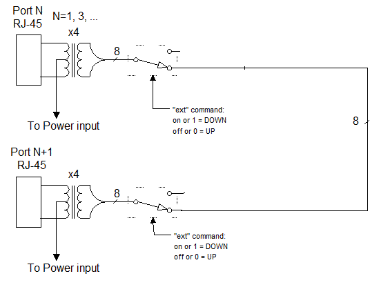

Data path
---------

>   The data path section allows the UUT port data to be in two states:
>   disconnected, or connected to the data of the next UUT port (default is
>   connected). This allows data to pass from port to port for testing.

>   DataPathGeneral
