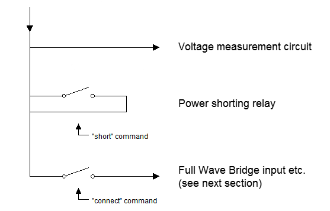

Power input
-----------

>   Power Input (above); two instances, one for each power pair:

>   Each UUT port can have either power pair measured (reported voltage can be
>   positive or negative depending on polarity), shorted, or connected to the
>   Full Wave Bridge and subsequent load circuits. The power pairs can be
>   measured regardless of the state of the connect or short relay settings.

>   *WARNING – Sustained currents above 1 amp through the shorting relay may
>   damage the connector, PCB, relay, etc.*
