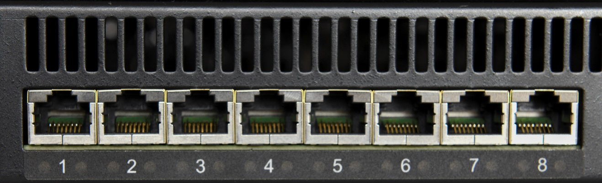

RJ-45 Ethernet Connectors
-------------------------

Picture 2: Far left side of RT-PoE5 front panel

>   There are 24 numbered UUT ports. The RJ connector should be cabled to the
>   corresponding PSE port using a standard Ethernet 1-1 jumper cable. When
>   enabled via software command, the data component of the port N (N=1,3,5,…)
>   will be connected to the data of port N+1 via Ethernet transformers and
>   relays. This is a straight-through connection, not a crossover.
