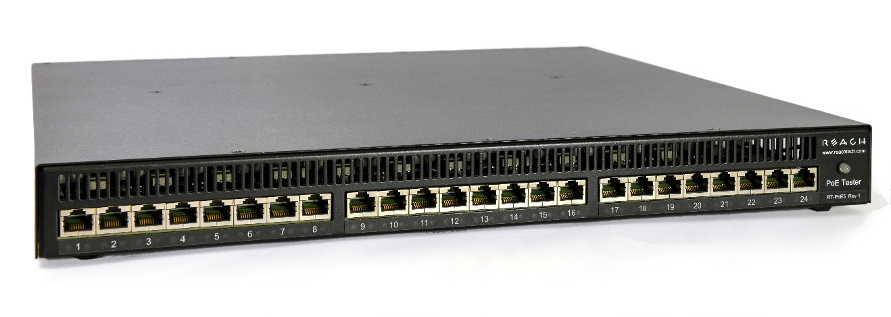
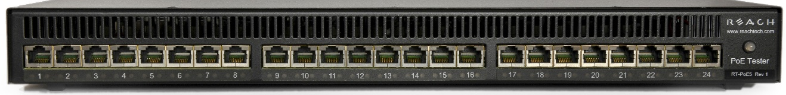
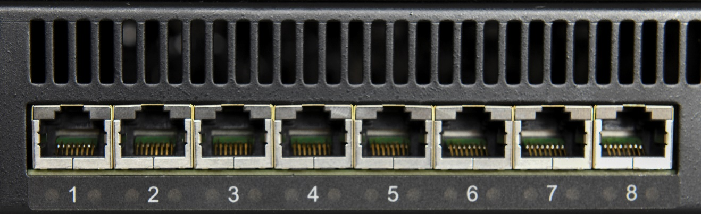
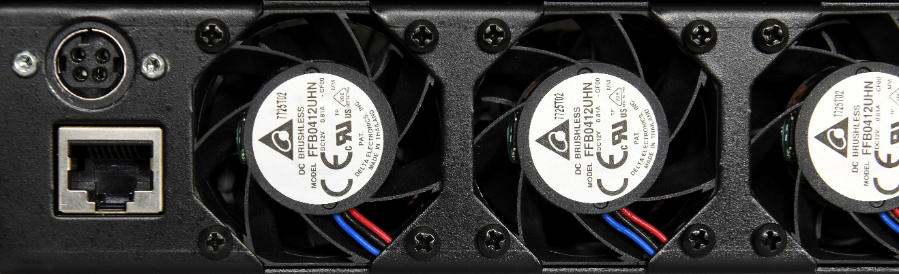
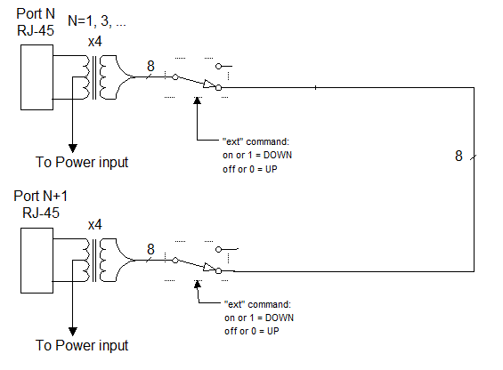
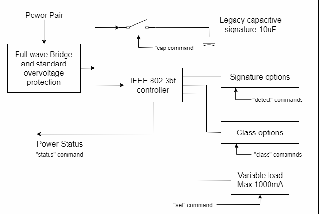
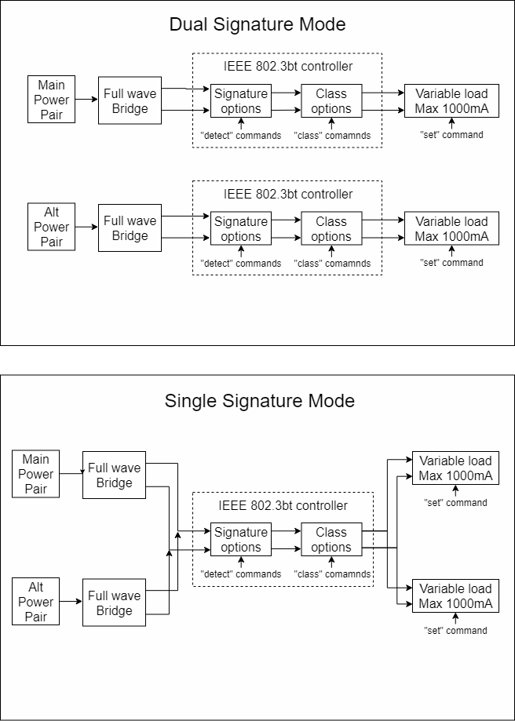
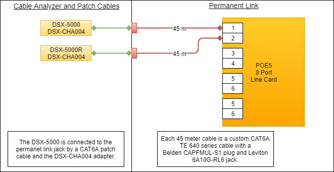
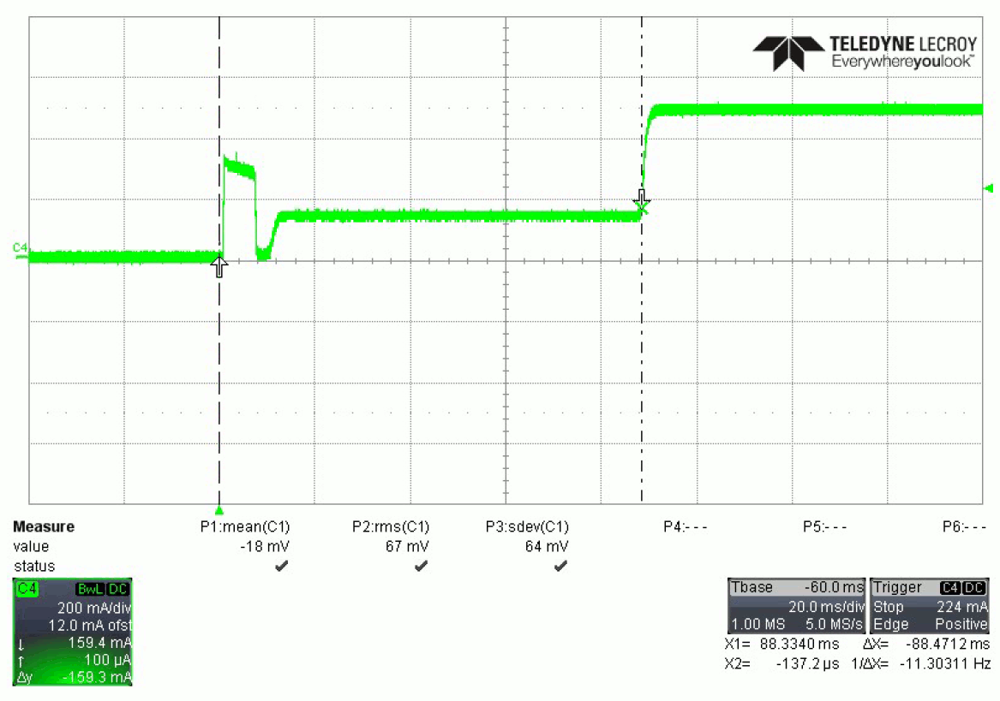

**Reach PoE5 Tester Manual 1.5**

**Model RT-PoE5**

**Software Version 1.01 and above**

**February 13, 2020**

© 2018-2020 Reach Technology, a Novanta Company

All Rights Reserved

**NOTE: The information contained in this user documentation is subject to
change without notice and does not represent a commitment on the part of Reach
Technology. Reach Technology assumes no responsibility or liability for any
errors or inaccuracies that may appear in this user documentation.**

Reach Technology

[www.reachtech.com](http://www.reachtech.com)

Sales

408-754-4176

<sales@reachtech.com>

Support

503-675-6464

<techsupport@reachtech.com>

**Table of Contents**

[1. Revision History 4](#revision-history)

[1.1. RT-PoE5 - Base Model 4](#rt-poe5---base-model)

[1.2. RT-PoE5 Variations 4](#rt-poe5-variations)

[2. General 5](#general)

[2.1. Overview 5](#overview)

[2.2. Front panel 5](#front-panel)

[2.3. Features 6](#features)

[2.4. Dimensions 6](#dimensions)

[2.5. Electrical Characteristics 6](#electrical-characteristics)

[2.6. Environmental 6](#environmental)

[2.7. Warranty 6](#warranty)

[2.8. Operating Software 6](#operating-software)

[2.9. Calibration 7](#calibration)

[3. Configuration Guide 8](#configuration-guide)

[3.1. Power 8](#power)

[3.2. Serial Console 8](#serial-console)

[3.3. UUT Connections 9](#uut-connections)

[4. Connectors and Jumpers 10](#connectors-and-jumpers)

[4.1. RJ-45 Ethernet Connectors 10](#rj-45-ethernet-connectors)

[4.2. Rear Connectors 10](#rear-connectors)

[4.3. Ethernet Power Selection 11](#ethernet-power-selection)

[5. Operational Overview 12](#operational-overview)

[5.1. Data path 12](#data-path)

[5.2. Power input 13](#power-input)

[5.3. Signature, class, and load 14](#signature-class-and-load)

[5.4. Dual/Single Signature Modes 15](#dualsingle-signature-modes)

[5.5. Fans 16](#fans)

[5.6. RJ45 LEDs 16](#rj45-leds)

[6. Ethernet Cables 17](#ethernet-cables)

[7. Command Reference 18](#command-reference)

[EEPROM Warning 18](#eeprom-warning)

[ECHO 19](#echo)

[ERROR CHECK 19](#error-check)

[HELP 19](#help)

[VERSION 19](#version)

[BAUD 20](#baud)

[BOOT 20](#boot)

[HOSTNAME 20](#hostname)

[SHOW ALL 21](#show-all)

[CLEAR 21](#clear)

[LOAD 21](#load)

[SAVE 22](#save)

[PORT / GROUP PREFIX 22](#port-group-prefix)

[CAP 22](#cap)

[CLASS – Single Signature 23](#class-single-signature)

[CLASS – Dual Signature 24](#class-dual-signature)

[CLASS – Autoclass 25](#class-autoclass)

[CONNECT 26](#connect)

[DETECT 26](#detect)

[EXT 26](#ext)

[GETI 27](#geti)

[GETP 27](#getp)

[GETV 27](#getv)

[INR 28](#inr)

[MPS 28](#mps)

[PSE 29](#pse)

[POWER 30](#power-1)

[RESET 30](#reset)

[SET 30](#set)

[SHORT 31](#short)

[SHOW 31](#show)

[SINGLE 32](#single)

[STATUS 32](#status)

[TEMPERATURE 32](#temperature)

[Appendix A - Operational Notes 33](#appendix-a---operational-notes)

[A.1 Power-on 33](#a.1-power-on)

[A.2 Error messages 34](#a.2-error-messages)

[A.3 Inrush Example Waveform 35](#a.3-inrush-example-waveform)

[Appendix B - Test Setups 36](#appendix-b---test-setups)

[B.1 Overview 36](#b.1-overview)

[B.2 Signature Detect 36](#b.2-signature-detect)

[B.3 Class Detect, dual signature mode
37](#b.3-class-detect-dual-signature-mode)

[B.4 Class Detect, single signature mode
38](#b.4-class-detect-single-signature-mode)

[B.5 Power Status and overload (IEEE 802.3af)
39](#b.5-power-status-and-overload-ieee-802.3af)

[B.6 Power Status and overload (IEEE 802.3at)
39](#b.6-power-status-and-overload-ieee-802.3at)

[B.7 Power Status and overload (IEEE 802.3bt, single signature)
40](#b.7-power-status-and-overload-ieee-802.3bt-single-signature)

[B.8 Power Status and overload (IEEE 802.3bt, dual signature)
40](#b.8-power-status-and-overload-ieee-802.3bt-dual-signature)

[B.9 Data transmission under power 41](#b.9-data-transmission-under-power)

[Appendix C - Specifications 42](#appendix-c---specifications)

[C.1 Measurement Specifications 42](#c.1-measurement-specifications)

[C.2 Limits 42](#c.2-limits)

[Appendix D – Manual Change History 43](#appendix-d-manual-change-history)

 Revision History
====================

RT-PoE5 - Base Model
--------------------

>   The Model RT-PoE5 is the initial version in production. It can be recognized
>   by the version string such as follows (see [VERSION](#version) command; also
>   seen on power-on).

>   Reach PoE Tester Model RT-PoE5/24

>   PN 53-0005-11 Rev A 0/1, SW 1.04, Jul 19 2019

>   Copyright (C) 2019 by Reach Technology, a Novanta Company

RT-PoE5 Variations
------------------

>   The PoE5 is available in a 24-port configuration, or in an 8-port
>   configuration. All ‘number of port’ references in this manual show the full
>   24 ports, but the 8-port models are limited to eight ports. There are no
>   differences between the 24-port model and the 8-port model other than the
>   number of ports.

 General
===========

Overview
--------

>   Manufacturers of Ethernet Power Sourcing Equipment (PSE) such as Ethernet
>   Switches need to test PoE power functionality during manufacturing. Once a
>   unit is in manufacturing, it can be assumed that it has already been tested
>   for full compliance with the applicable IEEE 802.3 PoE standard. It is not
>   cost-effective, nor necessary, to perform full compliance testing at the
>   manufacturing stage. What is needed is a functional test that verifies the
>   software’s ability to detect and control power, and the basic connectors’
>   and magnetics’ ability to provide power and pass data.

>   The Reach RT-PoE tester family is designed for cost-effective, functional
>   production testing. It assumes that the PSE can be operated in a
>   “diagnostic” mode whereby the power control and detection functions of the
>   PSE can be individually tested. Data protocol features such as the Link
>   Layer Discovery Protocol (LLDP) are not supported so as to keep the cost of
>   the tester low. Most switches provide a way of bypassing LLDP to provide
>   full power to a particular port. LLDP is implemented in firmware: if the
>   unit can pass data under power it can pass LLDP packets, and so testing LLDP
>   functionality is not necessary for a production test.

>   The Reach Power-over-Ethernet Tester Model RT-PoE5 provides diagnostic
>   functional testing of 24 PSE ports compatible with IEEE Standards 802.3af,
>   802.3at, and 802.3bt, plus it will support data path speeds up to 10GBASE-T.
>   It can draw up to 1000mA per power pair (100W total over four pairs) while
>   passing 10Gb traffic. It provides high density with 24 Powered Device (PD)
>   loads in a 1U high chassis.

>   Each RT-PoE5 section has a “UUT” port (Unit Under Test). The UUT port is
>   connected to the PSE and acts as a PD load to that port. The UUT data path
>   is connected via power-isolating magnetics to the adjacent UUT port (1 to 2,
>   3 to 4, 5 to 6, etc.). In this way, an external data bit error tester or PSE
>   test functionality can be used to test data integrity while power load is
>   enabled.

Front panel
-----------

Picture 1: Front of RT-PoE5

The front of the RT-PoE5.

Features
--------

-   IEEE signature options: nominal, low, and over-spec capacitive.

-   Classification 0 through 8, and autoclass (all nominal).

-   Passes 10GbE traffic from each test port to the neighboring port, isolated
    from PD load (1-2, 3-4, etc.).

-   Relay data path for compatibility with Phy-based cable diagnostics.

-   Low cost compared to compliance-level PD emulators.

-   Universal voltage (110/220) AC power supply.

-   Serial RS-232 console control.

Dimensions
----------

>   The unit fits in a standard 19" rack using screw-on ears.

>   Case outside dimensions are:

>   16.665" deep

>   17.30" wide (fits 19” rack; mounting ears provided)

>   1.74" high

Electrical Characteristics
--------------------------

>   The RT-PoE5 is powered via a locking power DIN 4 pin connector and requires
>   a power supply capable of supplying 12VDC at 11.5 amps.

>   The unit comes with a worldwide universal AC input power supply brick. Its
>   characteristics are:

>   85-264VAC input, 90% efficient, 0°C to 40°C operation, IEC320/C14 input

Environmental
-------------

>   Operating temperature range is 0°C to 40°C. Storage range is -30°C to 70°C.

>   Humidity is 85% maximum, non-condensing

Warranty
--------

>   The RT-PoE5 is warranted by Reach Technology against manufacturing defects
>   for one year.

Operating Software
------------------

>   No Software license is required.

Calibration
-----------

>   The PoE5 is factory-calibrated to ensure the voltage and current
>   measurements are accurate. These are two-point calibrations, with the
>   results stored in FLASH on the processor doing the measurements.

>   Contact Reach for additional calibration information.

 Configuration Guide
=======================

Power
-----

>   The power input is located on the rear of the unit. The power supply
>   provided is a "desktop" type brick with a three-prong IEC input connector.
>   An AC power cord compatible with U.S. power outlets is optional. There is no
>   power switch; it is on when the power is applied.

Serial Console
--------------

>   The serial console port is located at the rear of the unit. It is an RJ-45
>   with a three-wire RS-232 level interface. The interface has the same pinout
>   as found on Cisco routers and switches. The baud rate factory default is
>   115200, 1 stop, no parity, 8 bits. The baud rate can be changed by software
>   command – see the [BAUD](#baud) command in the Command Reference section.
>   Characters are echoed as they are typed (full duplex).

>   RJ-45 Connector:

| **Pin** | **Signal (DTE name)**    |
|---------|--------------------------|
| 1       | \*\*                     |
| 2       | \*\*                     |
| 3       | RS-232 data output (TxD) |
| 4       | Ground                   |
| 5       | Ground                   |
| 6       | RS-232 data input (RxD)  |
| 7       | \*\*                     |
| 8       | \*\*                     |

\*\* these signals are connected to each other

 UUT Connections
-------------------

>   The RT-PoE5 has 24 test ports, configured as 12 pairs (1-2, 3-4, 5-6, etc.).
>   Each port can act as a PD load to the UUT. Also, each port pair can be
>   configured to pass data from one port to the other via internal
>   straight-through connections, allowing the loads to be applied while passing
>   traffic. All data path connections are made via signal relays and 100 ohm
>   differential pairs for data integrity.

>   Connect the port of the PoE supplying device under test to the UUT connector
>   via a standard straight-through Ethernet connector (see the [Ethernet
>   Cables](#ethernet-cables) section for more information regarding cables).
>   There is an 802.3bt class transformer isolating the UUT ports in each port
>   pair so that power can be tapped from the UUT (see the [Data
>   Path](#data-path) section for more details).

>   Note that the devices connected to any given port pair cannot "see" the
>   power from the other port. In other words, the UUT ports in a port pair are
>   connected from a data perspective, and each UUT port connects to the RT-PoE5
>   active load from a power (PoE) perspective.

>   *NOTE: with high power loads, the DC balance of the patch cables used is
>   important to avoid DC saturation of the Ethernet transformers. DC Balance
>   (DC resistance per side of the power-carrying pair) should be within 3%. The
>   standard patch cable specifications of Cat 5, 5e, and 6 do not specify DC
>   balance.*

 Connectors and Jumpers
==========================

RJ-45 Ethernet Connectors
-------------------------

Picture 2: Far left side of RT-PoE5 front panel

>   There are 24 numbered UUT ports. The RJ connector should be cabled to the
>   corresponding PSE port using a standard Ethernet 1-1 jumper cable. When
>   enabled via software command, the data component of the port N (N=1,3,5,…)
>   will be connected to the data of port N+1 via Ethernet transformers and
>   relays. This is a straight-through connection, not a crossover.

Rear Connectors 
----------------

Picture 3: Far left side of RT-PoE5 rear panel

>   The left side of the rear of the unit is shown above. The power jack is a
>   power DIN 4 pin with lock type, KYCON KPPX-4. Pin 1,4 are 12VDC and pin 2,3
>   are GND. Below that is a console connector (RJ45, three-wire RS-232). See
>   the [Serial Console](#serial-console) section for pinout.

Ethernet Power Selection 
-------------------------

>   There are no jumpers required to set which conductors provide power. The
>   unit contains two separate power paths for pairs 1,2 / 3,6 and 4,5 / 7,8.
>   These have the standard full wave bridge, so any polarity is accepted. The
>   voltage measurement function handles either polarity and can be used to
>   validate the expected polarity of the PSE port.

>   Note that this manual follows the industry standard terminology of referring
>   to a power pair (four wires) as a “pair”. The wire-to-pair mapping is:

| **Power Pair** | **Physical Wires** |
|----------------|--------------------|
| Main           | 1, 2 and 3, 6      |
| Alt            | 4, 5 and 7, 8      |

>   Note that the “Cisco” standard 1,2 = negative and 3,6 = positive is reported
>   as a positive voltage (main pair). Alt pairs with 4,5 = positive, and 7,8 =
>   negative is reported as a positive voltage.

 Operational Overview
========================

Data path
---------

>   The data path section allows the UUT port data to be in two states:
>   disconnected, or connected to the data of the next UUT port (default is
>   connected). This allows data to pass from port to port for testing.

 Power input
---------------

>   Power Input (above); two instances, one for each power pair:

>   Each UUT port can have either power pair measured (reported voltage can be
>   positive or negative depending on polarity), shorted, or connected to the
>   Full Wave Bridge and subsequent load circuits. The power pairs can be
>   measured regardless of the state of the connect or short relay settings.

>   *WARNING – Sustained currents above 1 amp through the shorting relay may
>   damage the connector, PCB, relay, etc.*

 Signature, class, and load
------------------------------

>   One of these blocks per pair:

>   SignatureClassLoad

>   The IEEE 802.3bt controller (also known as the PD PoE controller) used is
>   the TI TPS2372.

>   The signature resistor options are nominal, or invalid (too low). This is
>   enough to validate the PSE’s ability to detect the physical IEEE signature.
>   A legacy capacitive load can be applied, which should cause the signature
>   detect to fail. This can also be used to simulate an AC load for AC
>   disconnect testing. The classification (Class) loads are standard. The
>   "power-good" status of the IEEE controller goes active once the load
>   capacitor (not shown) is charged and can be monitored via the “status”
>   command. This command reports the status of each of the two PoE PD
>   controllers. This will indicate which pairs are powered.

Dual/Single Signature Modes
---------------------------

>   Each port can operate in dual or single signature mode:

>   SingleDualSignature (1)

Fans
----

>   The fans run at a minimum speed whenever the tester is on and the loads are
>   disconnected. This is required to exhaust the internally-generated heat.

>   The fans will also run at a minimum speed when the total load on any test
>   port is 100mA or less (‘set’ value), or 4W or less (‘pwr’ value), and the
>   load is connected (“conn 1”).

>   The fans will run at full speed when any of the test ports have a total load
>   greater than 100mA or 4W, and the load is connected. After all ports are no
>   longer connected (e.g. reset command has been issued) the fans will run at
>   full speed until the nominal heatsink temperature has been reached, at which
>   point the fans return to the minimum speed.

RJ45 LEDs
---------

>   Each RJ45 connector has a yellow LED and a green LED. The yellow LED will be
>   lit when the port is processing a command from the control card/operator,
>   and will be off otherwise.

>   The green LED will be lit according to the following table when the
>   “power-good” status of the IEEE controllers go active. The “status” command
>   can also be used to report the “power-good” status of each PoE PD
>   controller.

| Green LED State       | Definition                          |
|-----------------------|-------------------------------------|
| Off                   | Both power-good signals inactive.   |
| On solid              | Both power-good signals active.     |
| One blink per second  | Main pair power-good signal active. |
| Two blinks per second | Alt pair power-good signal active.  |

>   Note that when the loads are connected and the fans are running, the PoE5
>   will send an internal command to the ports to check the heatsink
>   temperature. This will cause the yellow LED to blink on a regular basis, and
>   is normal operation.

 Ethernet Cables
===================

>   The performance of a CAT6A rated link is dependent on the cabling,
>   connectors, mated connections and hardware components that make up the link.

>   The PoE5 data path passes 10GBASE-T traffic from each test port to the
>   adjacent test port (ports 1-2, 3-4, etc.). The data path connections are
>   made through magnetics and signal relays for compatibility with Phy-based
>   cable diagnostics. When passing 10GBASE-T traffic through the PoE5 data
>   path, it is important to consider the type of cable, plugs and jacks used as
>   part of that link.

>   The PoE5 data paths are all tested to the TIA CAT6A permanent link test
>   limit using the DSX-5000 and the DSX-PLA004 permanent link adapters as shown
>   in Figure 1 below. The permanent link consists of two 40-meter CAT6A cables.
>   Each 40-meter length of cable consists of a plug mated to the test port, and
>   a jack mated to the DSX-PLA004 permanent link adapter. The cable and
>   connector combination shown in Figure 1 provided the best performance.

>   poe5-cableTest

>   Figure 1: PoE5 Permanent Link Test Setup

 Command Reference
=====================

>   This section describes the commands available. For typical command
>   sequences, see [Appendix B](#b.1-overview).

>   When the unit is ready for a command, it issues the default prompt
>   "RT-PoE5\>". The prompt may be changed via the "hostname" command so that a
>   unit can be identified by its prompt. Command buffering is not supported;
>   you must wait for the prompt before sending a command. The default baud rate
>   is 115200. This can be changed via the "baud" command and is preserved
>   across power cycles.

>   All commands are terminated by a \<return\> which is the HEX character 0x0D
>   (decimal 13).

>   Most commands have a short form version. The optional characters of a
>   command are indicated by the [ ] brackets.

>   Parameters shown within the \<\> characters are required parameters.

>   All commands that take "on" or "off" arguments can also take "1" and "0" as
>   arguments.

>   All commands that work with the pairs can use one of two different forms.
>   The first form, such as “conn 1” tells the PoE5 to connect both the main and
>   the alt pairs.

>   The second form lets the user specify values for each pair. A command such
>   as “conn 1,0” tells the PoE5 to connect just the main pair. Using the
>   command “conn 0,1” tells the PoE5 to connect the alt pair only. Using the
>   command “conn 1,1” is the same as using “conn 1”.

>   Responses from the unit that include variable data, such as the port number,
>   are shown as 'C'-language printf style strings, so the script writer knows
>   exactly what to expect as a response.

EEPROM Warning
--------------

>   **NOTE: The non-volatile memory used for EEPROM storage has a write cycle
>   limit of about 1,000,000 cycles. To prevent future issues, the user should
>   not include commands that write to EEPROM in repetitive scripts.**

 ECHO
--------

>   Description: Used to test the communication between the host and this unit.
>   This is useful at higher baud rates to validate a baud can be used without
>   error. A script can repeat the echo command continuously and verify that no
>   communication errors are present.

>   Command: echo \<string\>

>   \<string\> = any ASCII string. May contain spaces.

>   Example: echo this is a test

>   Response: "this is a test"

ERROR CHECK
-----------

>   Description: The unit maintains an error flag that is set if any error
>   messages are generated. This command reports the error flag value and then
>   clears the error flag. A test script can run an entire sequence of commands
>   and check at the end to make sure there were no errors instead of having to
>   check on a command-by-command basis.

>   Command: err[ors]

>   Result: "1 - one or more errors have occurred; error flag reset"  
>   - or -  
>   "0 - no errors have occurred"

HELP
----

>   Description Displays a list of available commands.

>   Command: he[lp]

>   Command: ?

>   Example: help

VERSION
-------

>   Description Displays software and hardware version

>   Command: vers[ion] [0\|1]

>   Result: "Reach PoE Tester Model RT-PoE5/24

>   PN 53-0005-11 Rev A 0/1, SW 1.04, Jul 19 2019

>   Copyright (C) 2019 by Reach Technology, a Novanta Company"

>   An error is generated if the line card versions are inconsistent; that is,
>   if the three 8-port line cards have different firmware. Use vers 1 to get a
>   verbose listing of version information with errors flagged.

BAUD
----

>   Description: Used to change the unit's baud rate. This will not take effect
>   until the unit power is cycled or the \*boot command is issued. This is done
>   to make sure the baud change is acceptable.  
>     
>   See [EEPROM Warning](#eeprom-warning).

>   Command: \*baud \<baudrate\>

>   \<baudrate\> = 9600, 19200, 38400, 57600, or 115200

>   Example: \*baud 19200

>   Response: "Console baud set to 19200. Cycle power or issue \*boot to effect
>   change."

BOOT
----

>   Description Resets the system to the power-on state. This is the same as if
>   the unit has its power cycled.

>   Command \*boot

HOSTNAME
--------

>   Description: Used to change the unit's prompt. This is useful in a
>   production system because it allows the user to know with which physical
>   unit it is communicating. Name must be equal or less than 31 characters
>   long.  
>     
>   See [EEPROM Warning](#eeprom-warning).

>   Command: \*host[name] \<string\>

>   Example: \*hostname myTester

>   This makes the unit's prompt "myTester\>"

SHOW ALL
--------

>   Description Shows the current (last-sent) state of all commands on each
>   port. Note that there is no ‘port’ or ‘group’ syntax for ‘show all’.

>   Command: sh[ow] all

>   Response: [See example below]

Example: show all

Example response: (table truncated for brevity)

|     | class | det   | cap | conn | set        | pwr    | ext | short | single | mps | inrush |
|-----|-------|-------|-----|------|------------|--------|-----|-------|--------|-----|--------|
| p1: | 3L,3L | OK,OK | 0,0 | 0,0  | 1000,1000  | \-SET- | 1   | 0,0   | 0      | 0,0 | 85     |
| …   | …     | …     | …   | …    | …          |        | …   | …     | …      | …   | …      |
| P8: | 4D,4D | LO,LO | 0,0 | 1,1  | \---PWR--- | 50,50  | 1   | 0,0   | 0      | 1,1 | 85     |

CLEAR 
------

>   Description Clear user settings in EEPROM. Note that there is no ‘port’ or
>   ‘group’ syntax for ‘\*clear’.  
>     
>   See [EEPROM Warning](#eeprom-warning).

>   Command: \*clear

>   Response: EEPROM clearing settings copy 1  
>   EEPROM clearing settings copy 1  
>   EEPROM settings cleared

LOAD 
-----

>   Description Load user settings from EEPROM. Note that there is no ‘port’ or
>   ‘group’ syntax for ‘\*load’.

>   Command: \*load

>   Response: EEPROM restoring user settings  
>   :p1 restored  
>   :p2 restored  
>   …  
>   :p24 restored

SAVE 
-----

>   Description Save current user settings to EEPROM. Note that there is no
>   ‘port’ or ‘group’ syntax for ‘save’.  
>     
>   See [EEPROM Warning](#eeprom-warning).

>   Command: \*save

>   Response: EEPROM saving configuration  
>   EEPROM user settings saved

PORT / GROUP PREFIX
-------------------

>   Description For all port-specific commands, a port or group prefix will
>   restrict the command to a specific port or port group. The prefix must be
>   followed by a space before the port command. If no prefix is used, the
>   command will be applied to all 24 ports.

>   Port Prefix: pN

>   This specified port N where N is from 1 to 24.

>   Group Prefix: gN

>   This specifies group N where N is from 1 to 3.

>   group 1 = ports 1-8

>   group 2 = ports 9-16

>   group 3 = ports 17-24

CAP
---

| Description | Controls the 10uF capacitor across the full-wave bridge. This represents either a legacy capacitive signature or an AC load. Using two values separated with a comma allows the main and alt pairs to be set differently, or a single value will be applied to both pairs. The default state is off for both pairs. |
|-------------|---------------------------------------------------------------------------------------------------------------------------------------------------------------------------------------------------------------------------------------------------------------------------------------------------------------------|
|             |                                                                                                                                                                                                                                                                                                                     |
| Command:    | cap \<on\|off\|0,0\|0,1\|1,0\|1,1\>                                                                                                                                                                                                                                                                                 |
|             |                                                                                                                                                                                                                                                                                                                     |
| Response:   | printf(":p%d cap %d\\r\\n", port, state);                                                                                                                                                                                                                                                                           |
|             | - or -                                                                                                                                                                                                                                                                                                              |
|             | printf(":p%d cap %d,%d\\r\\n",port,stateM,stateA); state = 1 or 0 for on and off respectively.                                                                                                                                                                                                                      |

CLASS – Single Signature
------------------------

| Description | Sets the IEEE load class while in single signature mode. See IEEE 802.3af, 802.3at, and 802.3bt specifications (external documents). The default setting is 0. |
|-------------|----------------------------------------------------------------------------------------------------------------------------------------------------------------|
|             |                                                                                                                                                                |
| Command:    | cl[ass] \<0\|1\|2\|3\|4\|5\|6\|7\|8\>                                                                                                                          |
|             |                                                                                                                                                                |
| Argument:   | class value                                                                                                                                                    |
|             |                                                                                                                                                                |
| Response:   | printf(":p%d class %d\\r\\n", port, class);                                                                                                                    |
| Example:    | sin 1                                                                                                                                                          |
|             | p9 cl 6                                                                                                                                                        |
| Response:   | :p9 class 6\<CR\>\<LF\>                                                                                                                                        |
|             | This sets port 9 IEEE "class" to 6.                                                                                                                            |

CLASS – Dual Signature
----------------------

| Description | Sets the IEEE load class while in dual signature mode. The command supports both the Type 1/2 “Legacy” class settings and the Type 3/4 “Compliant” class settings. See IEEE 802.3af, 802.3at, and 802.3bt specification (external documents). Using two values separated with a comma allows the main and alt pairs to be set differently, or a single value will be applied to both pairs. Use a capital ‘L’ after the class number to specify the dual signature legacy class. If left off, the compliant class setting is used. The default setting is 0 for both pairs. |
|-------------|-----------------------------------------------------------------------------------------------------------------------------------------------------------------------------------------------------------------------------------------------------------------------------------------------------------------------------------------------------------------------------------------------------------------------------------------------------------------------------------------------------------------------------------------------------------------------------|
|             |                                                                                                                                                                                                                                                                                                                                                                                                                                                                                                                                                                             |
| Command:    | cl[ass] \<0\|1\|2\|3\|4\|5\>[, 0\|1\|2\|3\|4\|5]                                                                                                                                                                                                                                                                                                                                                                                                                                                                                                                            |
|             | - or -                                                                                                                                                                                                                                                                                                                                                                                                                                                                                                                                                                      |
|             | cl[ass] \<0\|1L\|2L\|3L\|4L\>[, 0\|1L\|2L\|3L\|4L]                                                                                                                                                                                                                                                                                                                                                                                                                                                                                                                          |
|             |                                                                                                                                                                                                                                                                                                                                                                                                                                                                                                                                                                             |
| Argument:   | class value (append a capital ‘L’ for type 1/2 legacy class settings)                                                                                                                                                                                                                                                                                                                                                                                                                                                                                                       |
|             |                                                                                                                                                                                                                                                                                                                                                                                                                                                                                                                                                                             |
| Response:   | printf(":p%d class %d\\r\\n", port, class);                                                                                                                                                                                                                                                                                                                                                                                                                                                                                                                                 |
|             | - or -                                                                                                                                                                                                                                                                                                                                                                                                                                                                                                                                                                      |
|             | printf(":p%d class %d,%d\\r\\n",port,clsM,clsA);                                                                                                                                                                                                                                                                                                                                                                                                                                                                                                                            |
|             |                                                                                                                                                                                                                                                                                                                                                                                                                                                                                                                                                                             |
| Example:    | sin 0                                                                                                                                                                                                                                                                                                                                                                                                                                                                                                                                                                       |
|             | p9 cl 3                                                                                                                                                                                                                                                                                                                                                                                                                                                                                                                                                                     |
| Response:   | :p9 class 3D\<CR\>\<LF\>                                                                                                                                                                                                                                                                                                                                                                                                                                                                                                                                                    |
|             | This sets port 9 IEEE "class" to compliant class 3 on both pairs.                                                                                                                                                                                                                                                                                                                                                                                                                                                                                                           |
| Example:    | sin 0                                                                                                                                                                                                                                                                                                                                                                                                                                                                                                                                                                       |
|             | p1 cl 1L,2L                                                                                                                                                                                                                                                                                                                                                                                                                                                                                                                                                                 |
| Response:   | :p1 class 1L,2L\<CR\>\<LF\>                                                                                                                                                                                                                                                                                                                                                                                                                                                                                                                                                 |
|             | This sets port 1 IEEE "class" to legacy class 1 on the main pair and legacy class 2 on the alt pair.                                                                                                                                                                                                                                                                                                                                                                                                                                                                        |

CLASS – Autoclass
-----------------

| Description | Used to enable support for autoclass. Using two values separated with a comma allows the main and alt pairs to be set differently, or a single value will be applied to both pairs.                                                                                                                                                                                               |
|             |                                                                                                                                                                                                                                                                                                                                                                                   |
|             | Note that autoclass is an addition to the current number class setting, and when enabled, is indicated with an ‘A’ after the number class setting. The default setting is aoff for both pairs.                                                                                                                                                                                    |
|-------------|-----------------------------------------------------------------------------------------------------------------------------------------------------------------------------------------------------------------------------------------------------------------------------------------------------------------------------------------------------------------------------------|
|             |                                                                                                                                                                                                                                                                                                                                                                                   |
| Command:    | cl[ass] \<aon\|aoff\>                                                                                                                                                                                                                                                                                                                                                             |
|             |                                                                                                                                                                                                                                                                                                                                                                                   |
| Argument:   | “aon” for autoclass on, or “aoff” for autoclass off                                                                                                                                                                                                                                                                                                                               |
|             |                                                                                                                                                                                                                                                                                                                                                                                   |
| Response:   | printf(":p%d class %d%c\\r\\n",port,class,acls);                                                                                                                                                                                                                                                                                                                                  |
|             | - or -                                                                                                                                                                                                                                                                                                                                                                            |
|             | printf(":p%d class %d%c,%d%c\\r\\n", port,clsM,clsA,aclsM,aclsA);                                                                                                                                                                                                                                                                                                                 |
|             |                                                                                                                                                                                                                                                                                                                                                                                   |
| Example:    | p9 cl 3                                                                                                                                                                                                                                                                                                                                                                           |
|             | p9 cl aon                                                                                                                                                                                                                                                                                                                                                                         |
| Response:   | :p9 class 3A\<CR\>\<LF\>                                                                                                                                                                                                                                                                                                                                                          |
|             | This sets port 9 IEEE "class" to 3 on both pairs, with autoclass on.                                                                                                                                                                                                                                                                                                              |
| Example:    | p1 cl 1,2                                                                                                                                                                                                                                                                                                                                                                         |
|             | p1 cl aof                                                                                                                                                                                                                                                                                                                                                                         |
| Response:   | :p1 class 1,2\<CR\>\<LF\>                                                                                                                                                                                                                                                                                                                                                         |
|             | This sets port 1 IEEE "class" to 1 on the main pair and 2 on the alt pair, with autoclass off on both pairs.                                                                                                                                                                                                                                                                      |

CONNECT 
--------

>   Description Controls the relays that connect the power load circuitry to the
>   UUT port via the GbE transformer. From a power perspective, this is
>   equivalent to plugging in the RJ45 from the UUT. See the [Operational
>   Overview](#operational-overview) section for more details. Connect must be
>   ‘on’ for the UUT to see an IEEE 802.3af/at/bt PoE load. The connect command
>   can also be used to select the main, alternate, or both power pairs. If a
>   comma is present, the command assumes the user is specifying the connect
>   status of each pair individually. The first value is the connect status of
>   the main pair and the second is the alternate pair (e.g. when “connect 0,1”
>   is entered, only the alternate pair will be connected to the load).

>   Command: conn[ect] \<on\|off\|0\|1\|0,0\|0,1\|1,0\|1,1\>

>   Response: printf(":p%d Connect %d\\n", port, state);  
>   - or -  
>   printf(":p%d Connect %d,%d\\r\\n",port,stM,stA);

>   state = 1 or 0 for on and off respectively.

DETECT
------

>   Description Sets the IEEE 802.3af/at/bt detect signature. Using two values
>   separated with a comma allows the main and alt pairs to be set differently,
>   or a single value will be applied to both pairs.  
>     
>   The default setting is ok for both pairs.

>   Command: det[ect] \<ok\|lo\|ok,ok\|ok,lo\|lo,ok\|ok,ok\>

Arguments: ok signature resistance 24.9K ohms  
lo signature resistance 13K ohms

>   Response: printf(":p%d det %s\\n", port, arg);  
>   - or -  
>   printf(":p%d det %d,%d\\r\\n",port,argM,argA);

EXT 
----

>   Description Controls the connection of the data path from one test port to
>   another. The data path is connected between adjacent ports: 1-2, 3-4, etc.
>   when the ext command is set on for both ports. This is necessary for the
>   ports to send data to each other. When ext is off, the data path is open.  
>     
>   The default state is on.

>   Command: ext[ernal] \<on\|off\>

Response: printf(":p%d Ext Ref %d\\n", port, state);

>   state = 1 or 0 for on and off respectively.

 GETI 
---------

>   Description Measures the load current being drawn from the UUT on the main
>   and alt pairs individually, and as a total for both pairs. Current readings
>   are in milliamps.

>   Command: geti

>   Response: printf(":p%d %dmA, %dmA, %dmA\\r\\n",port,val, val_alt,
>   val_total);

Example: p1 geti

Example response: :p1 501mA, 500mA, 1001mA\<CR\>\<LF\>

GETP 
-----

>   Description Measures the load power being drawn from the UUT on the main and
>   alt pairs individually, and as a total for both pairs. Power readings are in
>   watts.

>   Command: getp

>   Response: printf(":p%d %dW, %dW, %dW\\r\\n",port,val, val_alt, val_total);

Example: p1 getp

Example response: :p1 50W, 50W, 100W\<CR\>\<LF\>

GETV 
-----

>   Description Measures the voltages from the UUT (center taps of GbE
>   magnetics) of both pairs. Reports the voltage as either positive or negative
>   depending on the polarity of the pair. The “Cisco” standard 1,2 = negative,
>   3,6 = positive is reported as a positive voltage (main pair). Alt pairs with
>   4,5 = positive, and 7,8 = negative is reported as a positive voltage.

>   Command: getv

>   Response: printf(":p%d %.1fV, %.1fV\\r\\n",port,fvalM,fvalA);

>   The result will be between -60.0 and 60.0

Example: p1 getv

Example response: :p1 50.5V, 0.0V\<CR\>\<LF\>

 INR
-------

>   Description Sets the time period (in milliseconds) of the inrush timer. The
>   default time period is 85ms, and the maximum time period is 255ms. The same
>   inrush time period is set for both pairs. The inrush timer controls the
>   application of the full ‘set’ command current, with a minimum current of
>   about 100ma being allowed during the inrush period. The inrush timer starts
>   when the input voltage goes above UVLO (38v typical). See [Appendix
>   A.3](#a.3-inrush-example-waveform) for an example waveform of the inrush
>   current.

>   Command: inr[ush] \<value\>

>   Response: printf(":p%d inrush delay %d ms\\r\\n", port, val);

Example: p1 inr 100

Example response: :p1 inrush delay 100 ms\<CR\>\<LF\>

MPS
---

| Description       | Turns the minimum power signature feature in the PD controller on or off. Using two values separated with a comma allows the main and alt pairs to be set differently, or a single value will be applied to both pairs. When MPS is on, the power signature will be 18.5mA, and will have a 26% duty cycle for PSE types 1 and 2, and a 5.4% duty cycle for PSE types 3 and 4. The default state is off for both pairs. |
|-------------------|-------------------------------------------------------------------------------------------------------------------------------------------------------------------------------------------------------------------------------------------------------------------------------------------------------------------------------------------------------------------------------------------------------------------------|
|                   |                                                                                                                                                                                                                                                                                                                                                                                                                         |
| Command:          | mps \<on\|off\|0,0\|0,1\|1,0\|1,1\>                                                                                                                                                                                                                                                                                                                                                                                     |
|                   |                                                                                                                                                                                                                                                                                                                                                                                                                         |
| Response:         | printf(":p%d mps %d\\r\\n", port, val);                                                                                                                                                                                                                                                                                                                                                                                 |
|                   | - or -                                                                                                                                                                                                                                                                                                                                                                                                                  |
|                   | printf(":p%d mps %d,%d\\r\\n",port,valM,valA);                                                                                                                                                                                                                                                                                                                                                                          |
| Example:          | p1 mps 1                                                                                                                                                                                                                                                                                                                                                                                                                |
| Example response: | :p1 mps 1\<CR\>\<LF\>                                                                                                                                                                                                                                                                                                                                                                                                   |

PSE 
----

>   Description Returns the state of the TPH, TPL and status bits from the TI
>   TP2372 PD controllers of both pairs. A “-“ indicates that the specified bit
>   is not set. These status bits are specific to the PD controller, and cam be
>   interpreted using the tables below (data from TI TP2372 spec).

>   Command: pse

>   Response: printf(":p%d MAIN: %s, %s, %s, ALT: %s, %s, %s\\r\\n", port, val);

Example: p1 pse

Example response: :p1 MAIN: TPH, - , - , ALT: TPH, - , - \<CR\>\<LF\>

Table 1 - TPH, TPL, BT and Allocated Power Truth Table

| PSE Type | PD Class | Number of Class Cycles | PSE Allocated Power at PD (W) | TPH  | TPL  |      |
|----------|----------|------------------------|-------------------------------|------|------|------|
| 1-2      | 0        | 1                      | 12.95                         | HIGH | HIGH | HIGH |
| 1-2      | 1        | 1                      | 3.84                          | HIGH | HIGH | HIGH |
| 1-2      | 2        | 1                      | 6.49                          | HIGH | HIGH | HIGH |
| 1-2      | 3        | 1                      | 12.95                         | HIGH | HIGH | HIGH |
| 2        | 4        | 2                      | 25.5                          | HIGH | LOW  | HIGH |
| 3-4      | 0        | 1                      | 12.95                         | HIGH | HIGH | LOW  |
| 3-4      | 1        | 1                      | 3.84                          | HIGH | HIGH | LOW  |
| 3-4      | 2        | 1                      | 6.49                          | HIGH | HIGH | LOW  |
| 3-4      | 3        | 1                      | 12.95                         | HIGH | HIGH | LOW  |
| 3-4      | 4        | 2-3                    | 25.5                          | HIGH | LOW  | LOW  |
| 3-4      | 5        | 4                      | 40                            | LOW  | HIGH | LOW  |
| 3-4      | 6        | 4                      | 51                            | LOW  | HIGH | LOW  |
| 4        | 7        | 5                      | 62                            | LOW  | LOW  | LOW  |
| 4        | 8        | 5                      | 71                            | LOW  | LOW  | LOW  |

Table 2 - Power Demotion Cases

| PSE Type | PD Class | Number of Class Cycles | PSE Allocated Power at PD (W) | TPH  | TPL  |     |
|----------|----------|------------------------|-------------------------------|------|------|-----|
| 3-4      | 4-8      | 1                      | 12.95                         | HIGH | HIGH | LOW |
| 3-4      | 5-8      | 2,3                    | 25.5                          | HIGH | LOW  | LOW |
| 3-4      | 7-8      | 4                      | 51                            | LOW  | HIGH | LOW |

POWER
-----

| Description       | Sets load control to ‘power’ mode, and sets load value in watts. If set above 100W (or 50W per pair) an error will occur. If a single value is used, it is divided in half, and each pair will draw half the specified amount. Using two values separated with a comma allows the main and alt pairs to be set differently. Single, odd, input values will be rounded down. |
|-------------------|-----------------------------------------------------------------------------------------------------------------------------------------------------------------------------------------------------------------------------------------------------------------------------------------------------------------------------------------------------------------------------|
|                   |                                                                                                                                                                                                                                                                                                                                                                             |
| Command:          | pwr \<value\>                                                                                                                                                                                                                                                                                                                                                               |
|                   | - or -                                                                                                                                                                                                                                                                                                                                                                      |
|                   | pwr \<value main\>,\<value alt\>                                                                                                                                                                                                                                                                                                                                            |
|                   |                                                                                                                                                                                                                                                                                                                                                                             |
| Response:         | printf(":p%d pwr %d, %d (%d) W\\r\\n", port, mVal, aVal, totalW);                                                                                                                                                                                                                                                                                                           |
| Example:          | p1 pwr 100                                                                                                                                                                                                                                                                                                                                                                  |
| Example response: | :p1 50, 50 (100) W\<CR\>\<LF\>                                                                                                                                                                                                                                                                                                                                              |

RESET 
------

>   Description Resets port(s) to fully disconnected state.

>   Command: res[et]

>   Response: printf(":p%d reset\\n", port);

SET
---

>   Description Sets load control to ‘current’ mode, and sets load value in
>   milliamps. If set too low, the minimum value will be set; if above 2000mA
>   (or 1000mA per pair) an error will occur. If a single value is used, it is
>   divided in half, and each pair will draw half the specified amount. Using
>   two values separated with a comma allows the main and alt pairs to be set
>   differently.

>   Command: set \<value\>  
>   set \<value main\>,\<value alt\>

>   Response: printf(":p%d %d, %dmA\\r\\n",port,valM,valA);  
>   - or -  
>   printf(":p%d %d, %dmA (min)\\r\\n",port,valM,valA);

Example: p1 set 350, 450

Example response: :p1 350, 450 mA\<CR\>\<LF\>

Example: g2 set 350

>   Example response: :p9 350 mA\<CR\>\<LF\>  
>   ….  
>   :p16 350 mA\<CR\>\<LF\>

SHORT
-----

>   Description Controls a relay that can short the UUT power before the full
>   wave bridge. Using two values separated with a comma allows the main and alt
>   pairs to be set differently, or a single value will be applied to both
>   pairs. *WARNING - SHORTING AT FULL POWER CAN DAMAGE UUT.*  
>     
>   The default state is off for both pairs.

>   Command: short \<on\|off\|0,0\|0,1\|1,0\|1,1\>

>   Response: printf(":p%d short %d\\r\\n", port, val);

Example: p1 short 1

Example response: :p1 short 1\<CR\>\<LF\>

SHOW
----

| Description       | Shows the current (last-sent) state of a specific command. For the ‘set’ and ‘pwr’ values, will also indicate which control mode (set/current or pwr/power) is in effect for each port. |
|-------------------|-----------------------------------------------------------------------------------------------------------------------------------------------------------------------------------------|
|                   |                                                                                                                                                                                         |
| Command:          | show \<cl\|det\|cap\|conn\|set\|pwr\|ext\|shor\|sin\|mps\|inr\>                                                                                                                         |
|                   |                                                                                                                                                                                         |
| Response:         | Depends on selected command, but is the same as the response of that command.                                                                                                           |
| Example:          | p1 sh cl                                                                                                                                                                                |
| Example response: | :p1 class 0,1\<CR\>\<LF\>                                                                                                                                                               |
| Example:          | p1 set 1000 p1 sh pwr                                                                                                                                                                   |
| Example response: | :p1 in SET control mode                                                                                                                                                                 |
| Example:          | p1 pwr 100 p1 sh set                                                                                                                                                                    |
| Example response: | :p1 in PWR control mode                                                                                                                                                                 |

SINGLE
------

>   Description Turns the single signature feature on or off. Setting the single
>   signature feature off reverts to the default dual signature mode.  
>     
>   The default state is off.

>   Command: sin[gle] \<on\|off\>

>   Response: printf(":p%d Single Signature\\r\\n");  
>   - or -  
>   printf(":p%d Dual Signature\\r\\n");

Example: p1 sin 1

Example response: :p1 Single Signature\<CR\>\<LF\>

Example: p1 sin 0

Example response: :p1 Dual Signature\<CR\>\<LF\>

STATUS 
-------

>   Description Returns the "Power Good" status of the IEEE load controllers.
>   The power status is active when the IEEE controller is receiving power above
>   the UVLO value (38v typical) and the load capacitor is charged. Also reports
>   if an over-temperature condition occurred that caused the port to be shut
>   down.

>   Command: st[atus]

>   Response: printf(":p%d PWR %d, %d\\n",port,state1,state2);

>   state = 1 or 0 for on and off respectively.

Example: p1 st

Example response: :p1 PWR 1, 1\<CR\>\<LF\>

TEMPERATURE
-----------

>   Description Reports the temperature of the drain pins of the MOSFET loads on
>   the main and alt pairs, as measured on the line card PCB.

>   Command: temp[erature]

>   Response: printf(":p%d %3d C, %3d C\\n", port, tempC, tempC);

Example: p2 temp

Example response: :p2 27 C, 29 C\<CR\>\<LF\>

 Appendix A - Operational Notes
==================================

A.1 Power-on
------------

>   The prompt "RT-PoE5\>" indicates that the unit is ready for commands.

>   ”(revision dependent version string)”

>   RT-PoE5\>

 A.2 Error messages
----------------------

>   All error messages begin with the "!" exclamation mark.

| *Error Message*                       | *Description*                                                                                                                           |
|---------------------------------------|-----------------------------------------------------------------------------------------------------------------------------------------|
| ! Syntax error                        | There was syntax error in the previous command.                                                                                         |
| ! Reach PoE Tester...                 | There is an internal version error in this unit.                                                                                        |
| ! invalid port value                  | The value given with the port prefix was not valid.                                                                                     |
| ! invalid group value                 | The value given with the group prefix was not valid.                                                                                    |
| ! run calibration first               | If the power-on calibration was interrupted, and the set or class commands are used, this error message is generated.                   |
| ! invalid class value for dual mode   | The CLASS command argument for a port in dual signature mode is not 0 thru 5.                                                           |
| ! invalid class for single mode       | The CLASS command argument for a port in single signature mode is not 0 thru 8, or an ‘L” was specified.                                |
| ! Error: set limit is 2000mA          | The argument for the SET command is too large.                                                                                          |
| ! Error: set limit is 1000mA per pair | The argument for the SET command is too large.                                                                                          |
| ! Error: pwr limit is 100W            | The argument for the PWR command is too large.                                                                                          |
| ! Error: pwr limit is 50W per pair    | The argument for the PWR command is too large.                                                                                          |
| ! unsupported baud rate               | Baud rate argument is invalid                                                                                                           |
| ! invalid arguments                   | Command argument(s) are invalid                                                                                                         |
| (other messages)                      | There are other messages that begin with an exclamation point that are internal errors. If these appear, the unit needs to be repaired. |

 A.3 Inrush Example Waveform
-------------------------------

>   The example waveform below shows the current waveform for the main pair on a
>   single port during the inrush period. The voltage is supplied by a standard
>   bulk power supply set to 50v. The commands used for the setup are:

>   p1 set 500,0  
>   p1 conn 1,0

>   The initial rising edge occurs when the voltage goes above about 38v, and
>   this pulse is the bulk capacitor charging. Then the load transitions to the
>   100ma (approx.) minimum load for the duration of the inrush timer setting
>   ([INR](#inr) command). When the inrush timer expires, the load goes to the
>   selected value of 500ma.

>   InrushWaveform

 Appendix B - Test Setups
============================

B.1 Overview
------------

>   This Appendix gives an overview of basic test setups. No port or group
>   prefixes are shown. PSE, PD as defined in IEEE 802.3bt. The RT-PoE5 commands
>   are issued in the order shown.

B.2 Signature Detect
--------------------

| **RT-PoE commands:**           | **PSE check after commands issued**                     |
|--------------------------------|---------------------------------------------------------|
| reset                          | Verify that the PSE recognizes a valid PD.              |
| detect ok                      |                                                         |
| mps on                         |                                                         |
| connect on                     |                                                         |
| connect off                    | Verify that the PSE detects a low signature resistance. |
| detect lo                      |                                                         |
| connect on                     |                                                         |
| connect off                    | Verify that the PSE recognizes a valid PD.              |
| detect ok                      |                                                         |
| connect on                     |                                                         |
| connect off                    | Verify that the PSE detects a bad capacitance.          |
| cap on                         |                                                         |
| connect on                     |                                                         |

 B.3 Class Detect, dual signature mode
-----------------------------------------

| **RT-PoE commands:**                      | **PSE check after commands issued**                                                       |
|-------------------------------------------|-------------------------------------------------------------------------------------------|
| reset                                     | Verify that the PSE sees a legacy class 0 PD.                                             |
| detect ok                                 |                                                                                           |
| single off                                |                                                                                           |
| class 0                                   |                                                                                           |
| connect on                                |                                                                                           |
| connect off                               | Verify that the PSE sees a compliant class 1 PD.                                          |
| class 1                                   |                                                                                           |
| connect on                                |                                                                                           |
| connect off                               | Verify that the PSE sees a legacy class 1 PD.                                             |
| class 1L                                  |                                                                                           |
| connect on                                |                                                                                           |
| connect off                               | Verify that the PSE sees a compliant class 5 PD.                                          |
| class 5                                   |                                                                                           |
| connect on                                |                                                                                           |
| connect off                               | Verify that the PSE is able to detect autoclass capability, and support a load of xxx mA. |
| class aon                                 |                                                                                           |
| set xxx                                   |                                                                                           |
| connect on                                |                                                                                           |

 B.4 Class Detect, single signature mode
-------------------------------------------

| **RT-PoE commands:**                          | **PSE check after commands issued**                                                       |
|-----------------------------------------------|-------------------------------------------------------------------------------------------|
| reset                                         | Verify that the PSE sees a class 0 PD.                                                    |
| detect ok                                     |                                                                                           |
| single on                                     |                                                                                           |
| mps 1                                         |                                                                                           |
| class 0                                       |                                                                                           |
| connect on                                    |                                                                                           |
| connect off                                   | Verify that the PSE sees a class 1 PD.                                                    |
| class 1                                       |                                                                                           |
| connect on                                    |                                                                                           |
| connect off                                   | Verify that the PSE sees a class 2 PD.                                                    |
| class 2                                       |                                                                                           |
| connect on                                    |                                                                                           |
| connect off                                   | Verify that the PSE sees a class 3 PD.                                                    |
| class 3                                       |                                                                                           |
| connect on                                    |                                                                                           |
| connect off                                   | Verify that the PSE sees a class 4 PD.                                                    |
| class 4                                       |                                                                                           |
| connect on                                    |                                                                                           |
| connect off                                   | Verify that the PSE sees a class 5 PD.                                                    |
| class 5                                       |                                                                                           |
| connect on                                    |                                                                                           |
| connect off                                   | Verify that the PSE sees a class 6 PD.                                                    |
| class 6                                       |                                                                                           |
| connect on                                    |                                                                                           |
| connect off                                   | Verify that the PSE sees a class 7 PD.                                                    |
| class 7                                       |                                                                                           |
| connect on                                    |                                                                                           |
| connect off                                   | Verify that the PSE sees a class 8 PD.                                                    |
| class 8                                       |                                                                                           |
| connect on                                    |                                                                                           |
| connect off                                   | Verify that the PSE is able to detect autoclass capability, and support a load of yyy mA. |
| class aon                                     |                                                                                           |
| set yyy                                       |                                                                                           |
| connect on                                    |                                                                                           |

 B.5 Power Status and overload (IEEE 802.3af)
------------------------------------------------

| **RT-PoE commands:**                  | **PSE check after commands issued**                               |
|---------------------------------------|-------------------------------------------------------------------|
| reset                                 |                                                                   |
| detect ok                             |                                                                   |
| class 3                               |                                                                   |
| set 20                                |                                                                   |
| connect on                            |                                                                   |
|                                       | Enable power to port                                              |
|                                       | Verify that PSE sees the device taking power.                     |
| status                                | Verify that power is on.                                          |
| getv                                  | Verify that voltages are as expected.                             |
| set 350                               | Verify that PSE is providing full power.                          |
| set 390                               | Verify that PSE sees overload and shuts off power.                |
| status                                | Verify that power is off.                                         |

B.6 Power Status and overload (IEEE 802.3at)
--------------------------------------------

Same as above, but use “class 4”, and “set 600” for full power and “set 660” for
overload.

 B.7 Power Status and overload (IEEE 802.3bt, single signature) 
-------------------------------------------------------------------

| **RT-PoE commands:**                           | **PSE check after commands issued**                                  |
|------------------------------------------------|----------------------------------------------------------------------|
| reset                                          |                                                                      |
| detect ok                                      |                                                                      |
| single on                                      |                                                                      |
| class 8                                        |                                                                      |
| set 20                                         |                                                                      |
| connect on                                     |                                                                      |
|                                                | Enable power to port                                                 |
|                                                | Verify that PSE sees the device is taking power.                     |
| status                                         | Verify that power is on.                                             |
| getv                                           | Verify that voltages are as expected.                                |
| set 1426                                       | Verify that PSE is providing full power.                             |
| set 2000                                       | Verify that PSE sees overload and shuts off power.                   |
| status                                         | Verify that power is off.                                            |

B.8 Power Status and overload (IEEE 802.3bt, dual signature) 
-------------------------------------------------------------

| **RT-PoE commands:**                            | **PSE check after commands issued**                                  |
|-------------------------------------------------|----------------------------------------------------------------------|
| reset                                           |                                                                      |
| detect ok                                       |                                                                      |
| single off                                      |                                                                      |
| class 5                                         |                                                                      |
| set 20                                          |                                                                      |
| connect on                                      |                                                                      |
|                                                 | Enable power to port                                                 |
|                                                 | Verify that PSE sees the device is taking power.                     |
| status                                          | Verify that power is on.                                             |
| getv                                            | Verify that voltages are as expected.                                |
| set 1426                                        | Verify that PSE is providing full power.                             |
| set 2000                                        | Verify that PSE sees overload and shuts off power.                   |
| status                                          | Verify that power is off.                                            |

B.9 Data transmission under power
---------------------------------

| **RT-PoE commands:**                  | **PSE check after commands issued**                                                |
|---------------------------------------|------------------------------------------------------------------------------------|
| (as above for specific test required) |                                                                                    |
|                                       | Enable power to port.                                                              |
|                                       | Verify that PSE sees that device powers up.                                        |
| status                                | Verify that power is on.                                                           |
| ext on                                | Run traffic test between port pairs 1 and 2, 3 and 4,…23 and 24. Verify no errors. |

 Appendix C - Specifications
===============================

C.1 Measurement Specifications
------------------------------

| Voltage Measurement         | ± 2% or ±0.5V whichever is greater                                                                         |
|-----------------------------|------------------------------------------------------------------------------------------------------------|
| Current setting, power load | ± 2% or ±2mA whichever is greater 5mA load guaranteed less than 5mA 10mA load guaranteed greater than 10mA |
| Current setting, class load | ± 2% or ±0.5mA whichever is greater                                                                        |

>   All specifications subject to change at any time without notice.

 C.2 Limits
-----------

| SET command | 1000mA per pair, or 2000mA total |
|-------------|----------------------------------|
| PWR command | 50W per pair, or 100W total      |

>   All specifications subject to change at any time without notice.

 Appendix D – Manual Change History
======================================

| Revision | Date       | Changes                                                                                                                                                                                                                                                                                                                                                     |
|----------|------------|-------------------------------------------------------------------------------------------------------------------------------------------------------------------------------------------------------------------------------------------------------------------------------------------------------------------------------------------------------------|
| 1.0      | 10/22/2018 | Initial release.                                                                                                                                                                                                                                                                                                                                            |
| 1.1      | 10/24/2018 | Added changes from reviews, fixed power connector pin out details in section 4.2.                                                                                                                                                                                                                                                                           |
| 1.2      | 11/14/2018 | Added warning about EEPROM life when using commands such as \*baud, \*hostname, \*save, or \*clear repetitively.                                                                                                                                                                                                                                            |
| 1.3      | 01/24/2019 | Added additional information to the INR command description regarding the inrush current. Added Appendix A.3 with an example waveform of the inrush current. Fixed a typo in the HOSTNAME command example. Added voltage clarification to the STATUS command description for power good. Added explanation of yellow LED activity when loads are connected. |
| 1.4      | 07/25/2019 | Added explanation, in the preface of section 7, of command forms that allow control of individual pairs. Added explanation/chart, in section 4.3, of which wires are the main and the alt power pairs.                                                                                                                                                      |
| 1.5      | 02/13/2020 | Removed links to old website.                                                                                                                                                                                                                                                                                                                               |
