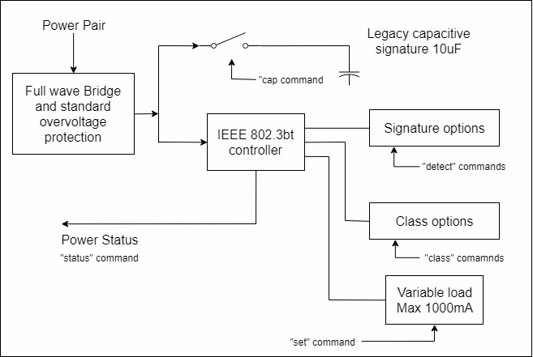

Signature, class, and load
--------------------------

>   One of these blocks per pair:

>   SignatureClassLoad

>   The IEEE 802.3bt controller (also known as the PD PoE controller) used is
>   the TI TPS2372.

>   The signature resistor options are nominal, or invalid (too low). This is
>   enough to validate the PSE’s ability to detect the physical IEEE signature.
>   A legacy capacitive load can be applied, which should cause the signature
>   detect to fail. This can also be used to simulate an AC load for AC
>   disconnect testing. The classification (Class) loads are standard. The
>   "power-good" status of the IEEE controller goes active once the load
>   capacitor (not shown) is charged and can be monitored via the “status”
>   command. This command reports the status of each of the two PoE PD
>   controllers. This will indicate which pairs are powered.
